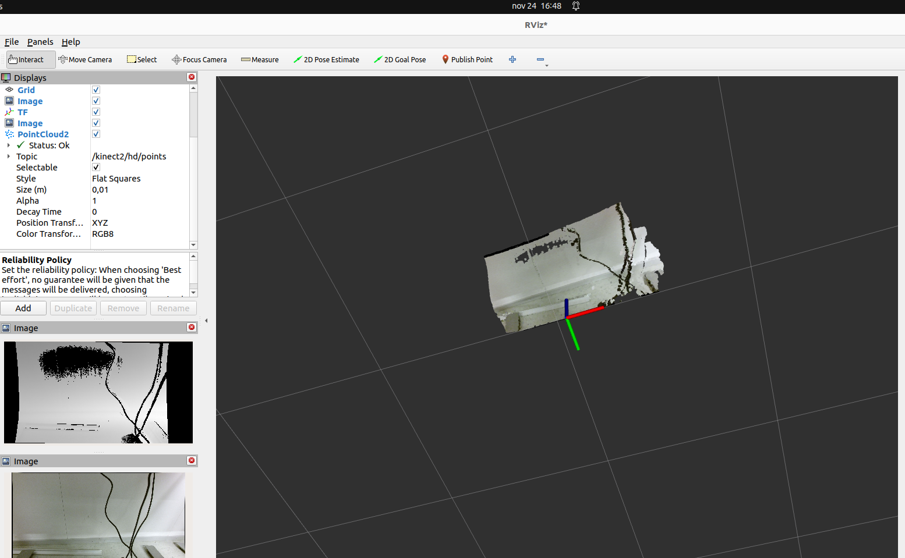
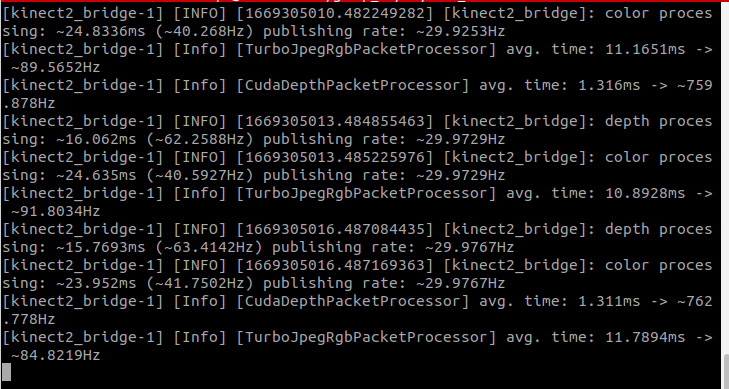

# IAI Kinect2 for ROS2

Migration from ROS1.
Original Repository: https://github.com/code-iai/iai_kinect2.
this work is based on OpenCV4 version: https://github.com/paul-shuvo/iai_kinect2_opencv4.


## Install:

1. Install the ROS2 humble.
2. Install [libfreenect2](https://github.com/OpenKinect/libfreenect2).
3. clone this repo to your workspace and build it
```bash
    cd ~/catkin_ws/src/
    git clone https://github.com/YuLiHN/kinect2_ros2
    cd kinect2_ros2
    rosdep install -r --from-paths .
    cd ~/catkin_ws
    colcon build
```

## Usage:
```
ros2 launch kinect2_bridge kinect2_bridge.launch.py
```
and visualize the results in rviz2
```
ros2 run rviz2 rviz2
```

## Screenshots:
Tested on RTX 3060 mobile, Ubuntu 22.04 LTS, ROS2 Humble.
Here are some screenshots from the toolkit:




## Fork and Pull:
This repo only contains kinect2_registration and kinect2_bridge, still have two packages to be completed.
